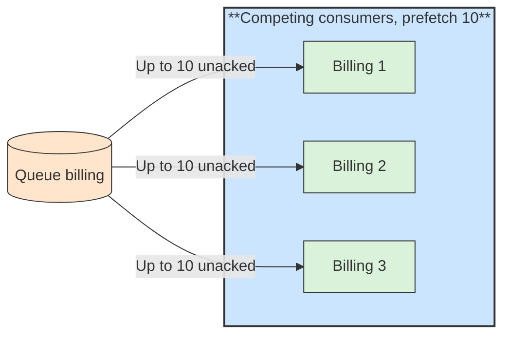

# ⚖️ Prefetch and Competing Consumers

## 📖 Concept
When several consumers read from the same queue, they become **competing consumers**: each message goes to exactly one of them, so adding instances increases throughput. Unlike a Kafka consumer group, there is no partition limit; any number of consumers can share one queue.

**Prefetch** (`basic.qos`) limits how many unacknowledged messages the broker sends to a consumer at once.

- Without a limit, the broker may push a large backlog to one consumer while others sit idle, and a slow consumer holds many messages.
- A small prefetch spreads work fairly and limits memory, but may reduce throughput if the round trip per message is significant.
- A prefetch of 1 gives the fairest distribution for slow, uneven tasks. Higher values, such as 10 to 50, suit fast tasks.

A different pattern applies when every instance must see every message: give each instance its own queue bound to the exchange (often an exclusive, auto-delete queue).

## 🛍️ Example
Three Billing instances share the `billing` queue with prefetch 10. A slow instance holds at most ten messages, and the others keep taking new ones.

## 📊 Diagram
Consumers compete for messages, and prefetch caps what each holds unacknowledged.

**Previous** → [Consumer and Acknowledgements](./08-consumer-and-acknowledgements.md)  
**Next** → [Durability and Persistence](./10-durability-and-persistence.md)
