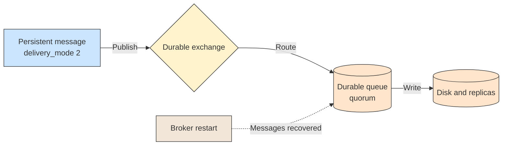

# 💾 Durability and Persistence

## 📖 Concept
Surviving a broker restart needs three things to line up:

- **Durable exchange** → The exchange definition is kept.
- **Durable queue** → The queue definition is kept.
- **Persistent message** → The message is written to disk (`delivery_mode = 2`).

If any one is missing, the data can be lost: a transient message in a durable queue is lost on restart, and a persistent message in a non-durable queue disappears with the queue. Persistence alone is not an instant guarantee, so combine it with publisher confirms.

For stronger guarantees across node failures, use **quorum queues**, which replicate messages across nodes with a Raft-based protocol. Classic queues on a single node lose data if that node's disk is lost. Persisting a message costs throughput, so reserve it for data that matters.

## 🛍️ Example
`order.placed` messages are persistent and go to a durable quorum queue, so they survive a restart. Live notification pings are transient, because losing one is acceptable.

## 📊 Diagram
Durable declarations and persistent messages are both needed.

**Previous** → [Prefetch and Competing Consumers](./09-prefetch-and-competing-consumers.md)  
**Next** → [Dead Letter Exchange, TTL and Retries](./11-dead-letter-exchange-ttl-and-retries.md)
