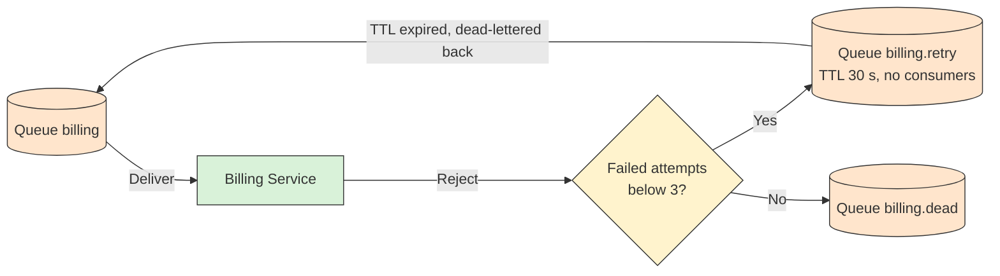

# ☠️ Dead Letter Exchange, TTL and Retries

## 📖 Concept
RabbitMQ has native support for dead lettering. A queue can name a **dead letter exchange (DLX)**, and messages are republished there when they are:

- **Rejected** (`reject` or `nack`) without requeue.
- **Expired** because of a **TTL** (time to live), set per message or per queue.
- **Dropped** because the queue exceeded its maximum length.
- **Returned** by a quorum queue after too many delivery attempts, when a delivery limit is set.

The DLX routes them to a dead letter queue for inspection and recovery. Dead-lettered messages carry an `x-death` header with the reason, queue, and count.

A common **retry** design uses a delay queue: failed messages go to a queue with a TTL and no consumers, and when the TTL expires they are dead-lettered back to the main exchange. Combine this with a maximum retry count read from `x-death`, then park the message in a final dead letter queue. See [Dead Letter Queue](../../../asynchronous-communication/dead-letter-queue/README.md) for the general pattern.

## 🛍️ Example
A failed charge is rejected and goes to `billing.retry`, which holds it for 30 seconds before returning it to `billing`. After three attempts, it lands in `billing.dead` for an operator.

## 📊 Diagram
Failures loop through a delay queue and finally park in a dead letter queue.

**Previous** → [Durability and Persistence](./10-durability-and-persistence.md)  
**Next** → [Clustering, Quorum Queues and Streams](./12-clustering-quorum-queues-and-streams.md)
