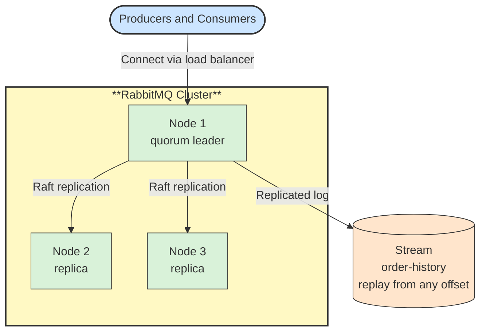

# 🧱 Clustering, Quorum Queues and Streams

## 📖 Concept
Several RabbitMQ nodes can form a **cluster** that shares definitions (exchanges, queues, bindings, users, vhosts). A cluster alone does not replicate queue contents, so the queue type decides what survives a node failure:

- **Classic queue** → Lives on one node. Simple and fast, but its messages are unavailable or lost if that node fails.
- **Quorum queue** → Replicated across an odd number of nodes (typically three) with the Raft consensus protocol. A leader handles operations and a majority must confirm each write, so it tolerates the loss of a minority of nodes. This is the default recommendation for durable data.
- **Stream** → A replicated, append-only log. Consumers read from any offset and messages are not removed when read, which allows replay, large fan-out, and high throughput, similar to a Kafka topic.

Clients should connect through a load balancer or list several nodes so they can reconnect after a failure. Run an odd number of nodes and avoid splitting a cluster over unreliable networks.

## 🛍️ Example
`billing` is a quorum queue replicated on three nodes, so it keeps working if one node fails. An `order-history` stream lets new services replay all orders from the beginning.

## 📊 Diagram
A quorum queue keeps replicas on several nodes, and a stream keeps a replicated log.

**Previous** → [Dead Letter Exchange, TTL and Retries](./11-dead-letter-exchange-ttl-and-retries.md)
