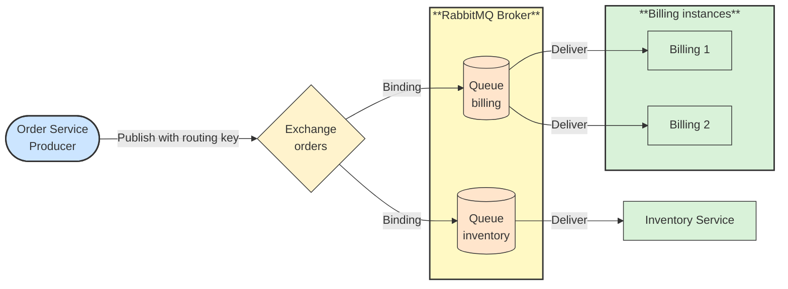

# 🔗 Recipe: RabbitMQ Fundamentals

## 📖 Problem
Teams adopting RabbitMQ often treat it as a simple queue and then hit surprises: messages that vanish after a restart, work piling up on one slow consumer, messages published to an exchange that match no queue, or poison messages that retry forever. Most of these come from not understanding how messages move from a producer to a queue.

**RabbitMQ** is a message broker that routes messages. Producers publish to **exchanges**, exchanges route messages to **queues** using bindings, and consumers read from queues and acknowledge each message. Unlike a Kafka log, a message is normally removed from a queue once it is acknowledged.

- Explains the main RabbitMQ concepts one at a time, in a learning order.
- Shows how each concept affects routing, reliability, and scaling.
- Complements the [Kafka Fundamentals](../kafka-fundamentals/README.md) recipe, so the two brokers can be compared.

---

## 🛍️ Case Study: E-Commerce Orders
An online retailer publishes an event whenever an order is placed. Billing must charge each order once, Inventory must reserve stock, and a notification service must email the customer.

- **Order Service** → Publishes `order.placed` messages.
- **Billing Service** → Consumes orders from its own queue; several instances share the work.
- **Inventory Service** → Consumes the same orders from its own queue.
- **Notification Service** → Receives only the events it subscribes to.

---

## 🛍️ Application Context
RabbitMQ fits task queues, work distribution, request/reply, and flexible routing where the broker decides which queues receive a message. It is less suited to replaying large histories of events for many independent readers, which is where a log such as Kafka is stronger. Recent RabbitMQ versions also offer **streams**, a log-style structure for that use case.

The concepts below are organized as a learning path, from connecting and routing, to reliable delivery, to failure handling.

---

## 🧭 Learning Path
Read the concepts in order. Each page introduces one idea, gives an order-processing example, and includes a diagram.

### Connecting and Routing
1. [Broker, Connection and Channel](./01-broker-connection-and-channel.md) → How clients talk to the broker.
2. [Virtual Host](./02-virtual-host.md) → Isolated namespaces inside one broker.
3. [Exchange](./03-exchange.md) → The entry point that receives published messages.
4. [Queue](./04-queue.md) → The buffer that holds messages for consumers.
5. [Binding and Routing Key](./05-binding-and-routing-key.md) → The rules that connect exchanges to queues.
6. [Exchange Types](./06-exchange-types.md) → Direct, fanout, topic, and headers routing.

### Publishing and Consuming
7. [Producer and Publisher Confirms](./07-producer-and-publisher-confirms.md) → Publish messages and know the broker accepted them.
8. [Consumer and Acknowledgements](./08-consumer-and-acknowledgements.md) → Process messages and confirm or reject them.
9. [Prefetch and Competing Consumers](./09-prefetch-and-competing-consumers.md) → Share work across instances without overloading them.

### Reliability
10. [Durability and Persistence](./10-durability-and-persistence.md) → Keep messages through broker restarts.
11. [Dead Letter Exchange, TTL and Retries](./11-dead-letter-exchange-ttl-and-retries.md) → Handle messages that fail or expire.
12. [Clustering, Quorum Queues and Streams](./12-clustering-quorum-queues-and-streams.md) → Survive node failures and choose the right queue type.

---

## ⚙️ General Practices
- **Give each consuming service its own queue** → Bind it to the exchange so every service gets its copy; instances of the same service share one queue.
- **Declare topology from code or definitions** → Declare exchanges, queues, and bindings idempotently at startup, or load them from versioned definitions.
- **Use manual acknowledgements** → Acknowledge only after the work is done, so a crash returns the message to the queue.
- **Make consumers idempotent** → Redelivery can happen, so processing the same message twice must be safe.
- **Enable publisher confirms for important messages** → Publishing is otherwise fire-and-forget.
- **Make data durable on purpose** → Use durable queues and persistent messages, and quorum queues for replicated data.
- **Set a prefetch limit** → Bound the number of unacknowledged messages per consumer to spread load and protect memory.
- **Route failures to a dead letter exchange** → Cap retries and park failing messages for inspection; see [Dead Letter Queue](../../../asynchronous-communication/dead-letter-queue/README.md).
- **Keep queues short** → Long queues mean consumers are too slow; alert on queue depth and age.
- **Use separate virtual hosts and users per environment or team** → Limit permissions to what each application needs.

---

## 📊 Diagram
A message flows from a producer through an exchange and bindings into queues, and then to consumers.

